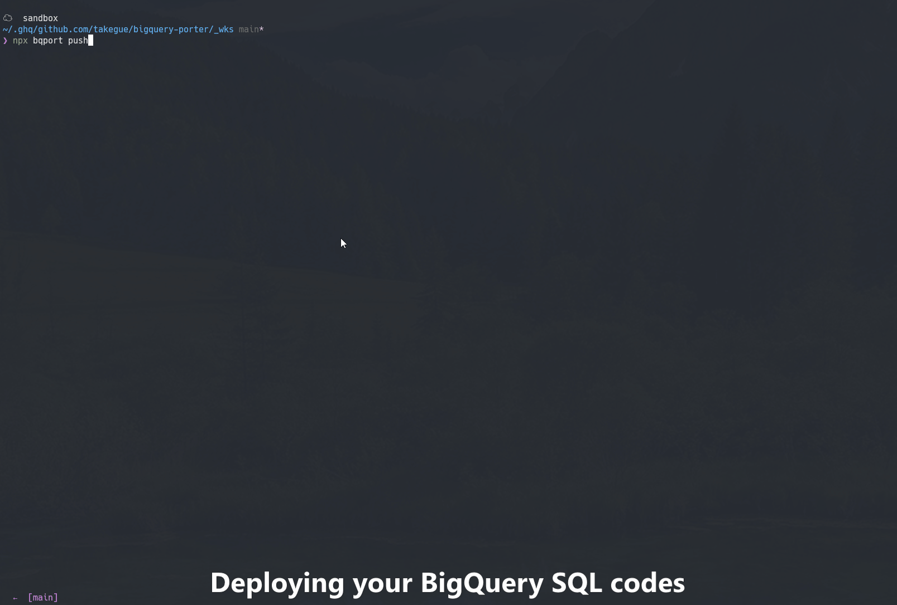

# BigQuery Porter

[](https://github.com/takegue/bigquery-porter/actions/workflows/ci.yml)

BigQuery Porter is a tool to manage BigQuery Resource and its metadata by filesystem.



## Get Started

### Installation

```
npm i bigquery-porter
```

Set up your OAuth and GCP Default Project.

### Clone BigQuery resources from your GCP Project

First step to start to use is cloning BigQuery resources as files in remote.
Next comamnd, you'll get BigQuery metadata files and DDL codes in local filesystem.

```sh
npx bqport pull --all --with-ddl
```

Typical directory strucuture follows:

```
(Root Directory)
`-- @default: Your Default GCP Project
    `-- sandbox
        |-- ddl.sql
        |-- metadata.json
        |-- @models
        |   `-- mymodel
        |       |-- ddl.sql
        |       `-- metadata.json
        |-- @routines
        |   |-- sample_function
        |   |   |-- ddl.sql
        |   |   `-- metadata.json
        |   |-- sample_procedure
        |   |   |-- ddl.sql
        |   |   `-- metadata.json
        |   `-- sample_tvf
        |       |-- ddl.sql
        |       `-- metadata.json
        |-- sample_clone_table
        |   |-- ddl.sql
        |   |-- metadata.json
        |   `-- schema.json
        |-- sample_materialized_view
        |   |-- ddl.sql
        |   |-- metadata.json
        |   `-- schema.json
        |-- sample_partition_table
        |   |-- ddl.sql
        |   |-- metadata.json
        |   `-- schema.json
        |-- sample_snapshot_table
        |   |-- ddl.sql
        |   |-- metadata.json
        |   `-- schema.json
        |-- sample_table
        |   |-- ddl.sql
        |   |-- metadata.json
        |   `-- schema.json
        `-- sample_view
            |-- metadata.json
            |-- schema.json
            `-- view.sql

`-- <other_projects>
```

#### Deploy Your BigQuery Resources

After you modifeid files in locals, you can deploy them by next command:
The following command will deploy to the default project in GCP.

```
npx bqport push
```

`bqport` deploys codes in prallel and topological order by SQL's DAG dependencies.


#### Partial Deployment from STDIN

You can also deploy your BigQuery queries from a list of SQL files.
This is useful for cases where you want to execute only specific SQL.
For example, a diff execution by git.

```
find ./bigquery -name '*.sql' | npx bqport push
```

## Dependency Resolution Behavior

`bigquery-porter` resolves dependencies in following order

0. DDL(DROP): `DROP TABLE` statement 
0. DDL(CREATE): `CREATE TABLE` statement
0. DDL(ALTER): `ALTER TABLE` statement
0. DML: `INSERT INTO`, `DELETE`,`TRUNCATE`, `MERGE` statements
0. QUERY

## Tips

### Vendoring BigQuery Datasets

For Example, Let's copy public datasets in `bqutil` project .

1. Fetch Dataset Metadata and DDL SQL file

```
npx bqport pull bqutil --all --with-ddl
```

2. Make your new destination project directory and copy files

```
mkdir -p bigquery/@default
cp -av bigquery/bqutil/fn bigquery/@default/fn
```

3. Fix old destination in SQL files to new one

```
npx bqport format
```

4. Deploy

```
npx bqport push @default
```
